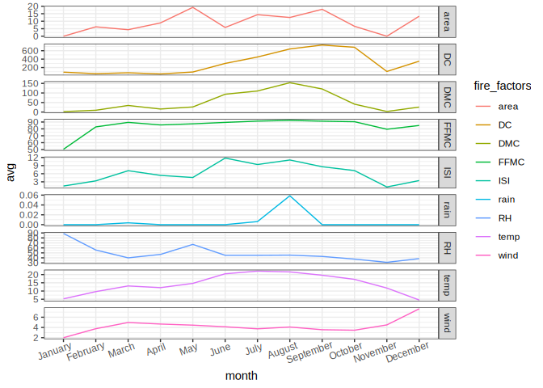
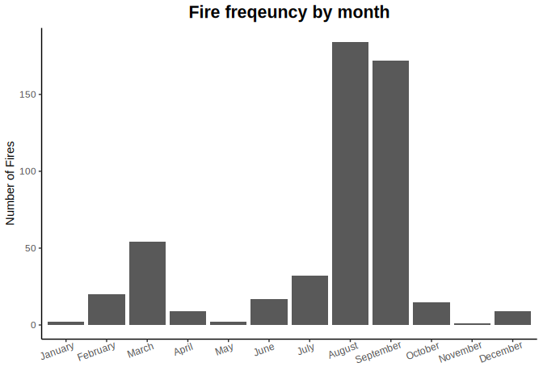

Forest fire factors report
================
Nate Sheibley
2024-07-16

# Portugal Forest Fire Factors

Forest fire data from Portugal will explored to identify which forest
fire factors correlate to frequency and severity of forest fires.

Data can be found
[here](https://dsserver-prod-resources-1.s3.amazonaws.com/277/forestfires.csv)

This data is associated with fosrest fire prediction modelling in
Portugal from [this](http://www3.dsi.uminho.pt/pcortez/fires.pdf) paper.

Cortez, Paulo, and Aníbal de Jesus Raimundo Morais. “A data mining
approach to predict forest fires using meteorological data.” (2007).

## Packages to be used

A subset of tidyverse packages.

All code is displayed. In a normal report, liberal use of echo=FALSE
would be used to hide visualization code.

``` r
packages <- c('yaml',
              'readr', 
              'tidyr', 
              'dplyr', 
              'tibble', 
              'stringr', 
              'lubridate',
              'knitr',
              'ggplot2')
renv::init()
#renv::install(packages)
lapply(packages, library, character.only=TRUE)
```

### Initial exploration

517 rows with 13 columns.

13 columns correspond to conditions and fire statistics.

Zero NA values.

``` r
forest_tib <- read_csv('forestfires.csv')
```

    ## Rows: 517 Columns: 13
    ## ── Column specification ────────────────────────────────────────────────────────
    ## Delimiter: ","
    ## chr  (2): month, day
    ## dbl (11): X, Y, FFMC, DMC, DC, ISI, temp, RH, wind, rain, area
    ## 
    ## ℹ Use `spec()` to retrieve the full column specification for this data.
    ## ℹ Specify the column types or set `show_col_types = FALSE` to quiet this message.

``` r
glimpse(forest_tib)
```

    ## Rows: 517
    ## Columns: 13
    ## $ X     <dbl> 7, 7, 7, 8, 8, 8, 8, 8, 8, 7, 7, 7, 6, 6, 6, 6, 5, 8, 6, 6, 6, 5…
    ## $ Y     <dbl> 5, 4, 4, 6, 6, 6, 6, 6, 6, 5, 5, 5, 5, 5, 5, 5, 5, 5, 4, 4, 4, 4…
    ## $ month <chr> "mar", "oct", "oct", "mar", "mar", "aug", "aug", "aug", "sep", "…
    ## $ day   <chr> "fri", "tue", "sat", "fri", "sun", "sun", "mon", "mon", "tue", "…
    ## $ FFMC  <dbl> 86.2, 90.6, 90.6, 91.7, 89.3, 92.3, 92.3, 91.5, 91.0, 92.5, 92.5…
    ## $ DMC   <dbl> 26.2, 35.4, 43.7, 33.3, 51.3, 85.3, 88.9, 145.4, 129.5, 88.0, 88…
    ## $ DC    <dbl> 94.3, 669.1, 686.9, 77.5, 102.2, 488.0, 495.6, 608.2, 692.6, 698…
    ## $ ISI   <dbl> 5.1, 6.7, 6.7, 9.0, 9.6, 14.7, 8.5, 10.7, 7.0, 7.1, 7.1, 22.6, 0…
    ## $ temp  <dbl> 8.2, 18.0, 14.6, 8.3, 11.4, 22.2, 24.1, 8.0, 13.1, 22.8, 17.8, 1…
    ## $ RH    <dbl> 51, 33, 33, 97, 99, 29, 27, 86, 63, 40, 51, 38, 72, 42, 21, 44, …
    ## $ wind  <dbl> 6.7, 0.9, 1.3, 4.0, 1.8, 5.4, 3.1, 2.2, 5.4, 4.0, 7.2, 4.0, 6.7,…
    ## $ rain  <dbl> 0.0, 0.0, 0.0, 0.2, 0.0, 0.0, 0.0, 0.0, 0.0, 0.0, 0.0, 0.0, 0.0,…
    ## $ area  <dbl> 0, 0, 0, 0, 0, 0, 0, 0, 0, 0, 0, 0, 0, 0, 0, 0, 0, 0, 0, 0, 0, 0…

``` r
sum(is.na(forest_tib))
```

    ## [1] 0

## Cleaning the data

### Cleaning and factoring dates

The date data is the only data needing cleaning

There are zero NA values in the dataset.

Zero area burned will be addressed in the analysis

``` r
# convert month string abbreviation to ordered month factor
# label according to month.name
# mutate to factor in order to save memory and increase speed
month_abbr <- tolower(month.abb)
forest_tib <- forest_tib %>% 
  mutate(month = factor(month,levels=month_abbr, ordered = T))
levels(forest_tib$month) <- month.name
#convert day of week to ordered factor
day_abbr = c('mon', 'tue', 'wed', 'thu', 'fri', 'sat', 'sun')
day_names <- c("Monday","Tuesday","Wednesday","Thursday","Friday","Saturday","Sunday")
forest_tib <- forest_tib %>% 
  mutate(day = factor(day,levels=day_abbr, ordered = T)) %>% 
  select(-c('X', 'Y'))
levels(forest_tib$day) <- day_names
```

## Aggregating fire data by month-date

Forest fires occur moderately more frequently near weekends (Friday
through Sunday) rather than midweek (Monday through Thursday).

This may indicate human causes may have an impact on the number of
forest fires

The vast majority of fires occur in August and September. This is the
dry season at the end of summer in the northern hemisphere.

There is also a small peak in March, which is interesting.

``` r
fires_by_month <- forest_tib %>% 
  group_by(month) %>% 
  summarise(num_fires=n())
fires_by_day <- forest_tib %>% 
  group_by(day) %>% 
  summarise(num_fires=n())
```

# Visualizations

### Set Theme for all plots.

``` r
classic_an <- theme_classic() + theme(plot.title = element_text(hjust = 0.5, face = 'bold', size = 16))
theme_set(classic_an)
```

## Fire frequency by day of the week

``` r
fires_by_day %>% 
  ggplot(aes(x=day, y=num_fires)) +
  geom_col() +
  labs(title='Fires freqeuncy by day of week', y='Number of Fires',x='')
```

<!-- -->

``` r
# Save named plot to plots folder
  ggsave("Fires_freqeuncy_by_day_of_week.jpeg", 
         path = "./forest_fire_report_files/")
```

    ## Saving 7 x 5 in image

## Fire frequency by month of the year

``` r
forest_tib %>% 
  ggplot(aes(x=month)) +
  geom_bar() +
  labs(title='Fire freqeuncy by month', y='Number of Fires', x='') +
  theme(axis.text.x = element_text(angle=20,hjust=0.8))
```

<!-- -->

``` r
# Save named plot to plots folder
  ggsave("Fire_freqeucy_by_month.jpeg", 
         path = "./forest_fire_report_files/")
```

    ## Saving 7 x 5 in image

## Fire Factors in August and September

There are clear increases in Duff Moisture Code index (DMC), and
temperature (temp) preceding and overlapping September and August.

Interestingly August had higher rainfall than average, so there could be
a connection between new growth and fire season, or thunderstorms.

The Fine Fuel Moisture Code index (FFMC) and Initial Spread Index (ISI)
are high for the entire summer preceding the increased fire likelyhood.

Drought Code index (DC) peaks after fire season, which is also
interesting.

ISI and wind correlate to the increase in number of fires in March,
along with an initial rise in temperature at the start of spring.

## Fire Factors in March

The Fine Fuel Moisture Code index (FFMC) initially rises and stabilizes
in march, from the lower winter values. Springtime also results in the
first of two increases in Initial Spread Index (ISI) and Duff moisture
code (DMC), and a local minima in relative humidity (RH).

``` r
fire_factor__freq_relations <- forest_tib %>% 
  pivot_longer(cols=-c(month, day), 
               names_to = 'fire_factors', 
               values_to = 'values') %>% 
  group_by(month, fire_factors) %>% 
  summarize(avg = mean(values))
```

    ## `summarise()` has grouped output by 'month'. You can override using the
    ## `.groups` argument.

``` r
fire_factor__freq_relations %>% 
  ggplot(aes(x=month, y=avg, 
             color = fire_factors, 
             group = fire_factors)) +
  geom_line()+
  labs(title = "Fire Factors - Frequency Relations",
       y = "Average fire factor value",
       x = "",
       color = "Fire factors") +
  facet_grid(rows=vars(fire_factors), 
             scales='free_y',
             ) +
  theme(axis.text.x = element_text(angle=20,hjust=0.8), 
        panel.grid.major = element_line(),
        panel.border = element_rect("black", fill=NA))
```

<!-- -->

``` r
# Save named plot to plots folder
  ggsave("fire_factors_by_month.jpeg", path = "./forest_fire_report_files/")
```

    ## Saving 7 x 5 in image

## Fire factor relationship with fire intensity

Area burned is used as a proxy for intensity.

There are 3 fires with areas above 300. The Graphs are provided with and
without those fires

Increasing temperature, DC, DMC, and FFMC all are related to increasing
fire intensity.

FFMC had a fire zero hectares in size as the lowest value by far,
changing the scale of the graph.

``` r
fire_factor_area_relations <- forest_tib %>% 
  pivot_longer(cols=-c(month, day, area), 
               names_to = 'fire_factors', 
               values_to = 'values')

fire_factor_area_relations %>% 
  ggplot(aes(y=area, x=values, color = fire_factors)) +
  geom_point()+
  facet_wrap(facets=vars(fire_factors), scales='free_x') +
  theme(panel.grid.major = element_line(), 
        panel.border = element_rect("black", fill=NA)) +
  labs(title = 'Fire factor intensity relations (all)',
       x = 'Fire factor values',
       y = 'Area burned (hectare)',
       color = "Fire factors")
```

<!-- -->

``` r
# Save named plot to plots folder
  ggsave("fire_factors_intensity_relation_all.jpeg", 
         path = "./forest_fire_report_files/")
```

    ## Saving 7 x 5 in image

``` r
fire_factor_area_relations %>% filter(area <  300 & area > 0) %>% 
  ggplot(aes(y=area, x=values, color = fire_factors)) +
  geom_point()+
  facet_wrap(facets = vars(fire_factors), scales ='free_x') +
  theme(panel.grid.major = element_line(), 
        panel.border = element_rect("black", fill=NA)) +
  labs(title = 'Fire factor intensity relations (0 < area < 300)',
       x = 'Fire factor values',
       y = 'Area burned (hectare)',
       color = "Fire factors")
```

<!-- -->

``` r
# Save named plot to plots folder
  ggsave("fire_factors_intensity_relation_<_300_ha.jpeg", 
         path = "./forest_fire_report_files/")
```

    ## Saving 7 x 5 in image

## Raw data variables, as documented in the referenced paper:

    X: X-axis spatial coordinate within the Montesinho park map: 1 to 9
    Y: Y-axis spatial coordinate within the Montesinho park map: 2 to 9
    month: Month of the year: 'jan' to 'dec'
    day: Day of the week: 'mon' to 'sun'
    FFMC: Fine Fuel Moisture Code index from the FWI system: 18.7 to 96.20
    DMC: Duff Moisture Code index from the FWI system: 1.1 to 291.3
    DC: Drought Code index from the FWI system: 7.9 to 860.6
    ISI: Initial Spread Index from the FWI system: 0.0 to 56.10
    temp: Temperature in Celsius degrees: 2.2 to 33.30
    RH: Relative humidity in percentage: 15.0 to 100
    wind: Wind speed in km/h: 0.40 to 9.40
    rain: Outside rain in mm/m2 : 0.0 to 6.4
    area: The burned area of the forest (in ha): 0.00 to 1090.84
